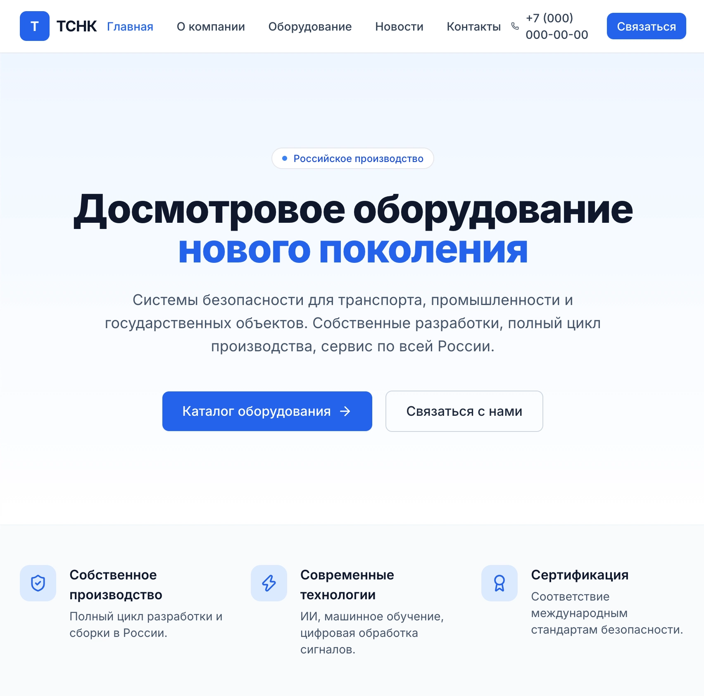
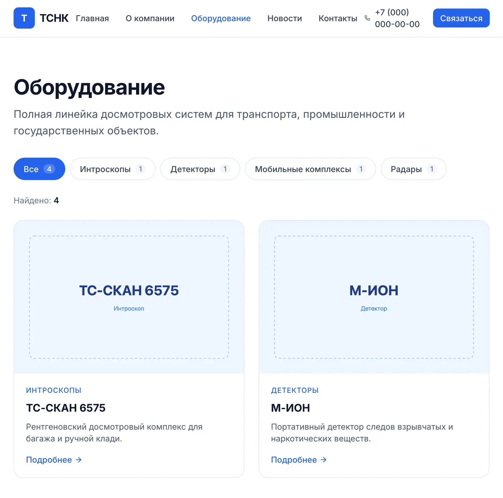
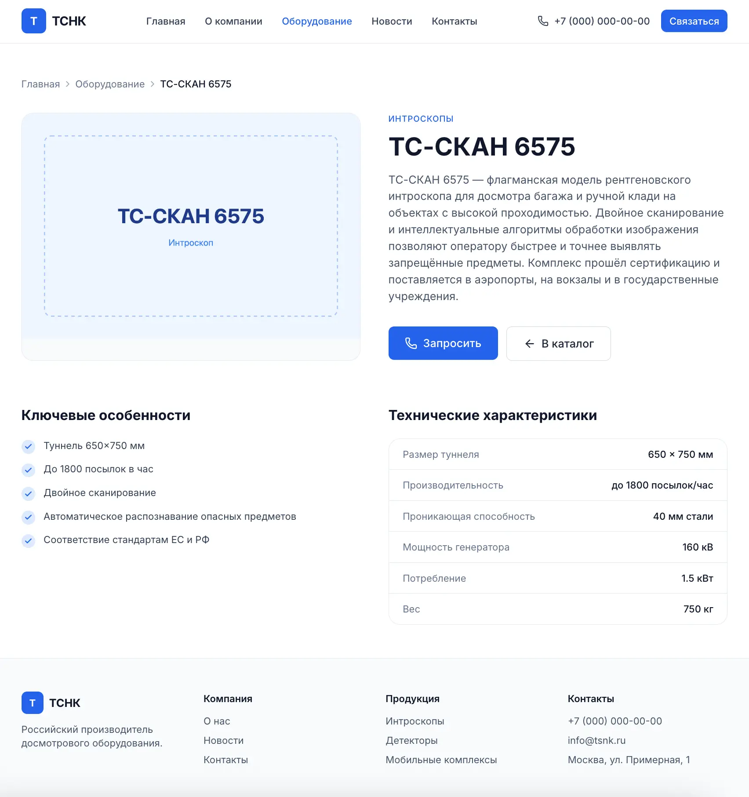
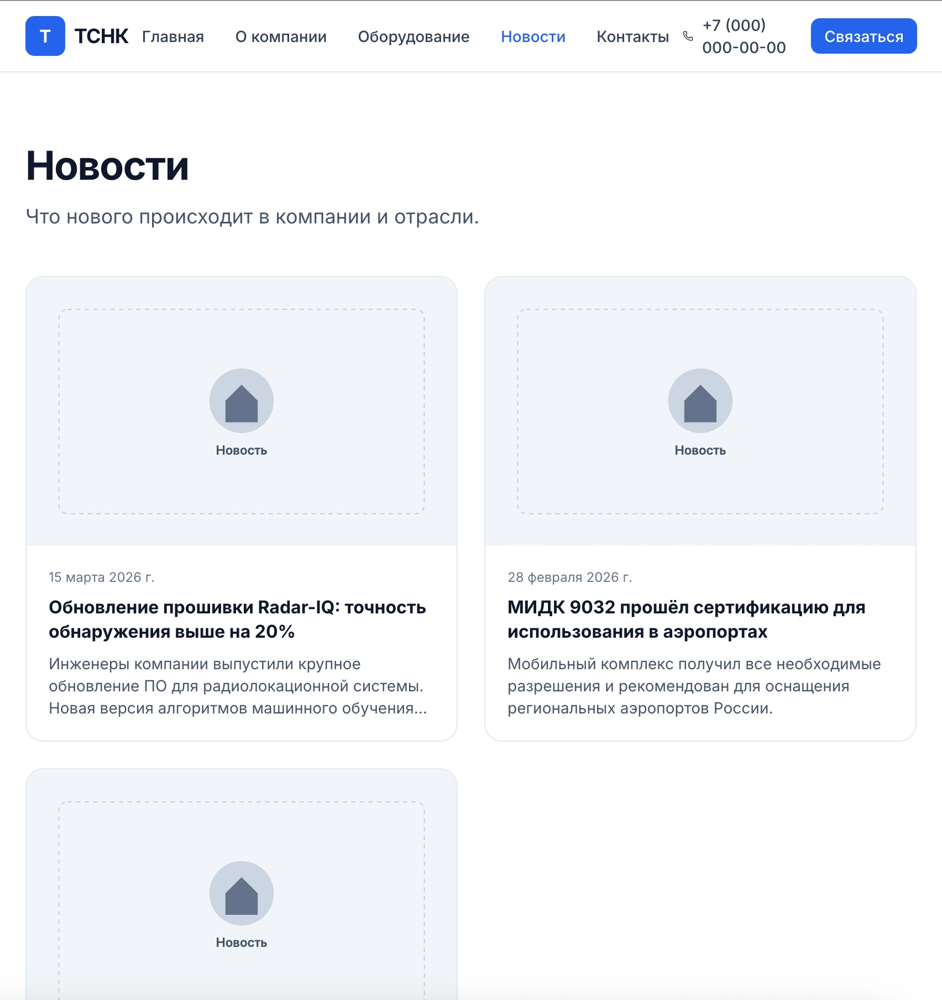

# ТСНК — клон сайта досмотрового оборудования

Учебный проект: современный редизайн корпоративного сайта производителя досмотрового оборудования [tsnk.ru](https://tsnk.ru). Реализован с нуля на React + TypeScript + Tailwind.

> **Дисклеймер:** проект создан исключительно в учебных целях. Все права на оригинальный контент, бренд и товарные знаки принадлежат ООО «Диагностика-М».

## 🔗 Демо

**[tsnk-nu.vercel.app](https://tsnk-nu.vercel.app)**

## 📸 Скриншоты

| Главная | Каталог |
|---|---|
|  |  |

| Продукт | Новости |
|---|---|
|  |  |

## ✨ Что реализовано

- **Главная** — hero-секция, преимущества, витрины продуктов и новостей, CTA-блок
- **Каталог оборудования** — фильтрация по 4 категориям с синхронизацией в URL (`?category=introscope`)
- **Страница продукта** — динамический роут `/equipment/:slug`, характеристики, ключевые особенности, похожие товары
- **Новости** — список с пагинацией через URL (`?page=2`), детальная страница `/news/:slug`
- **Контакты** — форма с валидацией (react-hook-form + zod), состояние успешной отправки, мок-отправка
- **О компании** — история, миссия, цифры, ценности
- **404** — кастомные страницы для общих путей и несуществующих продуктов/новостей

## 📊 Качество

Lighthouse на проде (mobile):

- ⚡ Performance — **97**
- ♿ Accessibility — **100**
- ✅ Best Practices — **100**
- 🔍 SEO — **100**

## 🛠 Стек

| Слой | Технологии |
|---|---|
| Сборка | Vite |
| Язык | TypeScript |
| UI | React 18 |
| Роутинг | React Router v6 |
| Стили | Tailwind CSS |
| Формы | react-hook-form + zod |
| Анимации | Framer Motion |
| Иконки | Lucide React |
| SEO | react-helmet-async |
| Хостинг | Vercel |
| Локализация | react-i18next + i18next-browser-languagedetector |

## 🚀 Запуск локально

```bash
# Клонировать
git clone https://github.com/igorzolo/tsnk-clone.git
cd tsnk-clone

# Установить зависимости
npm install

# Запустить dev-сервер
npm run dev
```

Приложение откроется на http://localhost:5173

## 📦 Сборка

```bash
npm run build
```

Готовый бандл окажется в `dist/`. Проект использует code-splitting — каждая страница грузится отдельным чанком.

## 🏗 Структура проекта

```
src/
├── components/
│   ├── ui/              # Базовые компоненты (Button, Input, Container, FadeIn)
│   ├── layout/          # Header, Footer, Layout
│   ├── ProductCard.tsx  # Карточка продукта
│   ├── NewsCard.tsx     # Карточка новости
│   ├── FilterBar.tsx    # Фильтры категорий
│   ├── Pagination.tsx   # Пагинация
│   ├── Breadcrumbs.tsx  # Хлебные крошки
│   ├── ScrollToTop.tsx  # Кнопка «Наверх»
│   ├── ScrollRestoration.tsx
│   └── Seo.tsx          # Управление метатегами
├── i18n/                # Конфигурация и переводы
│   ├── index.ts
│   └── locales/
│       ├── ru.json
│       └── en.json
├── hooks/
│   ├── useProducts.ts   # Продукты на текущем языке
│   └── useNews.ts       # Новости на текущем языке
├── pages/               # Страницы (Home, About, Equipment, News, Contacts, ...)
├── mocks/data/          # Мок-данные продуктов и новостей
├── types/               # TypeScript-типы
├── lib/                 # Утилиты и валидаторы
└── main.tsx
```

- **Локализация (i18n)** — полная поддержка русского и английского языков через react-i18next:
  - Переключение языка в хедере с сохранением в localStorage
  - Перевод всех страниц, метатегов и Open Graph
  - Локализованные данные (продукты, новости) через хуки `useProducts()` и `useNews()`
  - Валидация формы с переведёнными сообщениями об ошибках
  - Форматирование дат по локали (March 15, 2026 / 15 марта 2026 г.)

## 📄 Лицензия

Проект носит образовательный характер. Код можно свободно использовать в учебных целях.